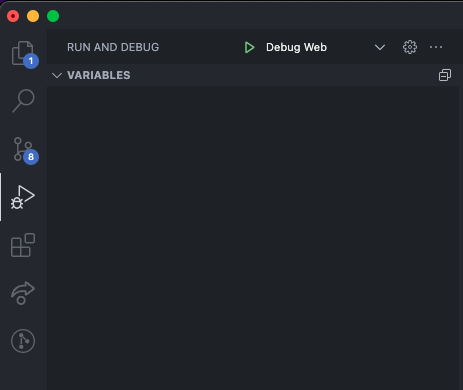

## Backend Tips

If you've never worked in PHP before, we can offer a few helpful starting points for working with it in our project.

### Debugging

We use `VS Code` at GoReact, and we have included some configuration in this project to assist you in setting breakpoints and debugging your PHP in your editor.

Ensure you install our recommended extensions by viewing your extensions tab, and look at the **Recommended** section.

Now, you can view your debugging tab and you should see a configuration in the dropdown up top called `Debug Web`. If you click the play icon, you can now set breakpoints in the backend directly in VS Code and step through the code as it executes.

You can do this same thing for your unit tests and step through them.

### Migrations

Depending on which steps you complete, you may need to update the database schema. The current schema can be inferred by looking at the files in the `api/database/migrations` directory.

We use [Laravel](https://laravel.com/docs) as the framework for our backend and it has features for everything you could need to do. Use the Search feature on the docs page to find ways to do things like generating a new migration or altering the schema of the database.

Most interactions with php or laravel will look similar to how you run the unit tests for the backend. Be sure to run your commands inside your docker container following instructions on the [README](./README.md)